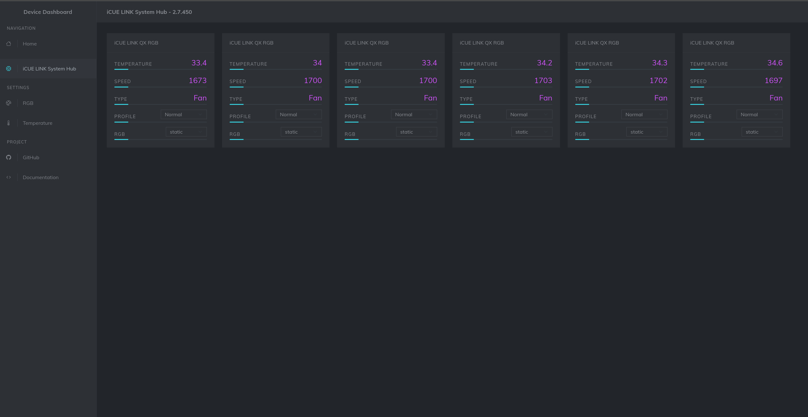

# LumenForge

LumenForge is an experimental Linux RGB, cooling, and device-control hub built as a fork of [OpenLinkHub](https://github.com/jurkovic-nikola/OpenLinkHub). It keeps OpenLinkHub's Corsair and Linux control foundation while adding OpenRGB-backed device import, RGB Cluster workflows with physical-layout ordering, dashboard improvements, built-in themes, optional system tray integration, and mixed-device lighting control.

LumenForge complements OpenLinkHub and OpenRGB; it does not replace either project. Hardware support varies, and OpenRGB-imported devices depend on both OpenRGB support and the metadata LumenForge can obtain for that device.

## Features

- Web UI at `http://127.0.0.1:27003`
- RGB Cluster for synchronizing lighting across mixed supported devices
- Rearrangeable RGB Cluster device order so animations can follow the physical layout of your setup
- OpenRGB-backed device import where supported by OpenRGB and available import metadata
- Dashboard overview with grouped device cards, lighting status, and card ordering
- Built-in UI themes
- Optional built-in system tray integration, tested on KDE Plasma and GNOME; other desktop environments may work if they support StatusNotifierItem and D-Bus menus, while Cinnamon is not currently supported
- Corsair hardware support inherited from OpenLinkHub
- Cooling profiles, fan curves, pumps, temperature sensors, and system metrics where supported
- RGB editor and custom lighting effects
- LCD support where supported
- Inherited keyboard, mouse, headset, memory, motherboard PWM, XENEON, and other device support where supported

Related documentation:

- [Supported device list](docs/supported-devices.md)
- [Configuration reference](docs/configuration.md)
- [OpenRGB device import](docs/openrgb-import.md)
- [Memory DDR4 / DDR5](docs/memory-configuration.md)
- [Motherboard PWM](docs/motherboard-pwm.md)
- [SCUF controller audio configuration](docs/scuf-controller.md)
- [XENEON EDGE KDE](docs/xeneon-edge-kde.md)
- [HTTP API](api/README.md)



## Project Status

LumenForge exists because I wanted the OpenLinkHub-style UI and control model with broader mixed-device RGB control. OpenRGB import brings supported OpenRGB-backed devices into LumenForge's dashboard and RGB Cluster workflows.

This is experimental alpha software developed and tested primarily against my own Linux setup. Use it at your own risk. LumenForge is not an official Corsair, OpenRGB, or OpenLinkHub product.

## Alpha Installation

The required starting point for this alpha is a local source build from a fresh checkout. The system-service installer remains the currently supported installation mode. Package repositories, release archives, containers, and automatic remote installation are not yet validated for LumenForge.

### Requirements

- Go 1.25 or newer
- A C compiler and `pkg-config`
- libudev development files
- PipeWire development files
- USB utilities

Debian or Ubuntu:

```bash
sudo apt-get update
sudo apt-get install build-essential git libudev-dev libpipewire-0.3-dev pkg-config usbutils
```

Fedora or other RPM-based distributions:

```bash
sudo dnf install gcc git libudev-devel pipewire-devel pkg-config usbutils
```

### Build

```bash
git clone https://github.com/Alaric07/LumenForge.git
cd LumenForge
./scripts/build.sh
```

Ordinary source builds use the tracked `0.2.0-alpha-dev` development version. Future authorized release automation can supply `VERSION` to override it; the build script removes one optional leading lowercase `v`.

For example, a future authorized release build could use:

```bash
VERSION=v0.2.0-alpha ./scripts/build.sh
```

Run directly from the repository:

```bash
./LumenForge
```

Hardware access may require appropriate udev permissions.

### Supported System-Service Installation

After building from source, run `install.sh` to install LumenForge under `/opt/LumenForge` with a system-level systemd service:

```bash
chmod +x install.sh
sudo ./install.sh
```

The service runs under the dedicated `lumenforge` account. The installer refuses known conflicting user-service installations rather than enabling both service modes. This remains the currently supported installation mode for the alpha.

Then open `http://127.0.0.1:27003`.

### Experimental User-Service Installation

`install-user-space.sh` is implemented and available for experimental validation, but it is not yet a supported or stable installation path. Build LumenForge from source, then run the installer as the intended desktop user, not as root:

```bash
chmod +x install-user-space.sh
./install-user-space.sh
```

This installer places LumenForge under `/opt/LumenForge` and creates a systemd user service for the current desktop user. It still requests temporary privilege escalation for the shared udev rule, `lumenforge` group creation and membership, installation ownership, and device access. If the user is newly added to the `lumenforge` group, log out and back in or reboot before expecting the service to have device access.

The user-service installer refuses to continue while a conflicting system-level `LumenForge.service` is active or enabled. Only one LumenForge service mode should be installed or active at a time.

### Upgrades

Prepare the new version in a fresh source checkout and build it there. If a release archive becomes available through a validated channel in the future, extract it into a fresh release directory. Run the same installer mode used for the existing installation, and never run either installer from `/opt/LumenForge`.

An installer upgrade refreshes shipped application assets while preserving runtime-owned configuration and user data, including:

- `config.json`
- Device profiles
- Per-device RGB data
- Macros
- Key assignments
- Temperature profiles
- User LCD uploads
- Other runtime-owned database content

This preservation applies to the defined runtime-owned data; it does not guarantee preservation of every arbitrary file placed under `/opt/LumenForge`.

### Immutable Distributions

The user-service installer is implemented and available for experimental validation, including investigation on immutable distributions. It is not yet supported, stable, or advertised as a production-ready immutable-distribution installation path.

### Distribution Status

The following installation channels are not yet validated or advertised as supported for this alpha:

- `.deb` and `.rpm` packages
- PPA and Copr repositories
- GitHub release tarballs
- `remote-install.sh`
- Stable or production use of the experimental user-service installer on immutable distributions

Docker support is also not yet validated. The inherited `Dockerfile` may require review before use.

## Configuration

LumenForge creates `config.json` on first run. It is stored in the working directory, which is `/opt/LumenForge/config.json` for either installer-managed service mode.

See the [configuration reference](docs/configuration.md) for the complete generated defaults, exact JSON types and accepted values, restart requirements, dependencies, legacy fields, and service-mode environment behaviour.

### OpenRGB Controller Import

OpenRGB must already be running with its SDK Server available on the configured `openRGBPort`. LumenForge does not install, launch, stop, restart, or otherwise manage OpenRGB itself.

Controllers are discovered and explicitly imported through Settings. Imported controllers can be refreshed, removed, and later reimported without losing their stable identity, saved layout, profile, or RGB state.

Some OpenRGB controllers report incomplete metadata or zero LEDs. In those cases, LumenForge may provide a conservative, editable fallback layout. Confirm zone and LED counts in OpenRGB before saving layout changes. An incorrect LED count may cause OpenRGB to ignore lighting updates until the correct values are restored.

See the [OpenRGB import guide](docs/openrgb-import.md) for detailed setup, import, layout, removal, and troubleshooting procedures.

> [!WARNING]
> Keep `listenAddress` set to `127.0.0.1` unless access to the host is otherwise secured. LumenForge's HTTP API can change device, cooling, lighting, profile, and backup settings and does not currently provide built-in authentication.

`enableSystemTray` enables the built-in system tray integration. It has been tested on KDE Plasma and GNOME. Other desktop environments may also work if they provide compatible StatusNotifierItem and `com.canonical.dbusmenu` support. Cinnamon is not currently supported.

## Progressive Web App

The web UI can be installed as a progressive web app in supported Chromium-based browsers. Firefox does not currently provide the same PWA installation support.

## Uninstall

Back up any desired runtime configuration from `/opt/LumenForge` before removing either installer-managed service mode.

Stopping, disabling, and removing one service unit is safe for that service mode. Both modes use the shared `/opt/LumenForge` installation and `/etc/udev/rules.d/99-lumenforge.rules` rule. Remove those shared resources only after confirming that no system-service installation or other user-service installation still needs them. Reload the udev rules after removing the shared rule.

### System-Service Uninstall

```bash
sudo systemctl stop LumenForge.service
sudo systemctl disable LumenForge.service
sudo rm -f /etc/systemd/system/LumenForge.service
sudo rm -f /usr/lib/systemd/system/LumenForge.service
sudo systemctl daemon-reload
```

### Experimental User-Service Uninstall

Run these commands as the desktop user that owns the user service:

```bash
systemctl --user stop LumenForge.service
systemctl --user disable LumenForge.service
rm -f ~/.config/systemd/user/LumenForge.service
systemctl --user daemon-reload
```

### Shared Resource Removal

Only after making the shared-resource confirmation above, remove the shared files and reload the udev rules:

```bash
sudo rm -f /etc/udev/rules.d/99-lumenforge.rules
sudo udevadm control --reload-rules
sudo udevadm trigger
sudo rm -rf /opt/LumenForge
```

## Runtime Notes

- LCD images and animations are stored in `/opt/LumenForge/database/lcd/images/` for installer-managed installations.
- The dashboard is available at `http://127.0.0.1:27003/`.
- Per-device RGB state is generated under `database/rgb/` and can be edited through the RGB editor.
- LumenForge includes an HTTP server for device overview and control; see the [API documentation](api/README.md).
