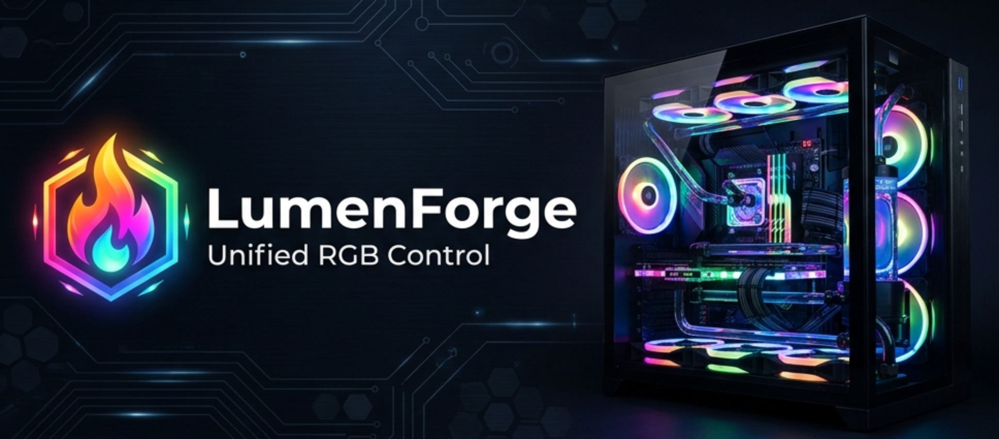

<p align="center">
  
</p>

# LumenForge

LumenForge is an experimental Linux RGB, cooling, and device-control hub built as a fork of [OpenLinkHub](https://github.com/jurkovic-nikola/OpenLinkHub). It keeps OpenLinkHub's Corsair and Linux control foundation while adding OpenRGB-backed device import, RGB Cluster workflows with physical-layout ordering, dashboard improvements, built-in themes, optional system tray integration, and mixed-device lighting control.

LumenForge complements OpenLinkHub and OpenRGB; it does not replace either project. Hardware support varies, and OpenRGB-imported devices depend on both OpenRGB support and the metadata LumenForge can obtain for that device.

LumenForge is a local-only application. Its dashboard, HTTP API, OpenRGB importer, and optional inherited OpenRGB-compatible target listener are restricted to `127.0.0.1`; remote dashboard or API access is unsupported.

The dashboard is supported through `http://127.0.0.1:<listenPort>` and
`http://localhost:<listenPort>`. HTTP Host validation accepts only those local
identities. Browser mutations require same-origin validation and a
LumenForge-specific request proof; CORS and remote web clients are unsupported.
See the [HTTP API guide](api/README.md#local-request-protection) before using a
local command-line client for POST, PUT, PATCH, or DELETE requests.

## Features

- Web UI at `http://127.0.0.1:27003`
- RGB Cluster for synchronizing lighting across mixed supported devices
- Rearrangeable RGB Cluster device order so animations can follow the physical layout of your setup
- OpenRGB-backed device import where supported by OpenRGB and available import metadata
- Dashboard overview with grouped device cards, lighting status, and card ordering
- Built-in UI themes
- Optional built-in system tray integration, tested on KDE Plasma and GNOME; other desktop environments may work if they support StatusNotifierItem and D-Bus menus, while Cinnamon is not currently supported
- Corsair hardware support inherited from OpenLinkHub
- Cooling profiles, fan curves, pumps, temperature sensors, and system metrics where supported
- RGB editor and custom lighting effects
- LCD support where supported
- Inherited keyboard, mouse, headset, memory, motherboard PWM, XENEON, and other device support where supported

Related documentation:

- [Supported device list](docs/supported-devices.md)
- [Configuration reference](docs/configuration.md)
- [Backup and restore](docs/backup-restore.md)
- [OpenRGB device import](docs/openrgb-import.md)
- [Memory DDR4 / DDR5](docs/memory-configuration.md)
- [Motherboard PWM](docs/motherboard-pwm.md)
- [SCUF controller audio configuration](docs/scuf-controller.md)
- [XENEON EDGE KDE](docs/xeneon-edge-kde.md)
- [HTTP API](api/README.md)


## Project Status

LumenForge exists because I wanted the OpenLinkHub-style UI and control model with broader mixed-device RGB control. OpenRGB import brings supported OpenRGB-backed devices into LumenForge's dashboard and RGB Cluster workflows.

This is experimental alpha software developed and tested primarily against my own Linux setup. Use it at your own risk. LumenForge is not an official Corsair, OpenRGB, or OpenLinkHub product.

## Alpha Installation

The required starting point for this alpha is a local source build from a fresh checkout. Choose the user or system service according to how LumenForge will run. Package repositories and release archives are not yet validated for LumenForge.

### Requirements

- Go 1.25 or newer
- A C compiler and `pkg-config`
- libudev development files
- PipeWire development files
- USB utilities

Debian or Ubuntu:

```bash
sudo apt-get update
sudo apt-get install build-essential git libudev-dev libpipewire-0.3-dev pkg-config usbutils
```

Fedora or other RPM-based distributions:

```bash
sudo dnf install gcc git libudev-devel pipewire-devel pkg-config usbutils
```

### Build

```bash
git clone https://github.com/Alaric07/LumenForge.git
cd LumenForge
./scripts/build.sh
```

Maintainers preparing a release should follow the [release process](docs/releasing.md).

Run directly from the repository:

```bash
./LumenForge
```

Hardware access may require appropriate udev permissions.

### User-Service Installation — Recommended for Desktop Use

After building from source, run `install-user-space.sh` as the intended desktop user, not as root:

```bash
chmod +x install-user-space.sh
./install-user-space.sh
```

This installer places immutable application files under `/opt/LumenForge`,
creates configuration and mutable data beneath the desktop user's XDG
directories, and installs the user unit at
`$XDG_CONFIG_HOME/systemd/user/LumenForge.service` (falling back to
`~/.config/systemd/user/LumenForge.service`). It requests temporary privilege
escalation only for the root-owned application tree, shared udev rule, and
`lumenforge` device-access group. Manage the installed service as the desktop
user:

```bash
systemctl --user status LumenForge.service
systemctl --user restart LumenForge.service
```

The user service starts with the logged-in user session and is the required service mode for LumenForge's system tray. Set `enableSystemTray` to `true` in `config.json` and restart the user service to enable it. **Open Dashboard** opens the configured local dashboard in the default browser, normally at `http://127.0.0.1:27003`.

#### First-Install Reboot

If the installer adds the desktop user to the `lumenforge` group, reboot before relying on hardware access. Existing login sessions do not acquire new supplementary group membership, and restarting only the service is not sufficient. A complete logout and login can technically refresh group membership, but reboot is the recommended and tested procedure, particularly for RAM/SMBus and other hardware permissions. The enabled user service starts automatically after the new session begins.

The installer refuses to continue while a conflicting system-level `LumenForge.service` is active or enabled. Only one LumenForge service mode should be installed or active at a time.

### System-Service Installation — Headless or Desktop-Independent Use

Run `install.sh` with root privileges to install LumenForge under `/opt/LumenForge` as a system-level service:

```bash
chmod +x install.sh
sudo ./install.sh
```

The system service starts at system boot under the dedicated `lumenforge` account and is appropriate for headless, server-style, or desktop-independent operation. Manage it with `sudo systemctl`, for example:

```bash
sudo systemctl status LumenForge.service
sudo systemctl restart LumenForge.service
```

Because the system service is outside the logged-in user's graphical and session D-Bus environment, it does not provide the desktop system tray. Open the dashboard directly at `http://127.0.0.1:27003`.

### Upgrades

There is no separate upgrade script. Installation and upgrade use the same
mode-specific installer.

#### User-Service Upgrade

Obtain a fresh source checkout or extracted release directory, then build
LumenForge or use the included release binary as appropriate. Run the installer
as the desktop user:

```bash
./install-user-space.sh
```

The installer detects and stops the existing user service, replaces the binary
and shipped release assets, reloads and enables the user unit, and starts it
again when the current login session has the required `lumenforge` group
membership.

#### System-Service Upgrade

Obtain a fresh source checkout or extracted release directory, then build
LumenForge or use the included release binary as appropriate. Run:

```bash
sudo ./install.sh
```

Always use the same installer mode as the existing installation. Never run
either installer from `/opt/LumenForge`; both intentionally refuse to run from
the installed directory. To switch service modes, first stop, disable, and
remove the existing service using the appropriate [uninstall](#uninstall)
instructions, then run the other installer from a fresh source or release
directory.

Both installer paths replace only the root-owned immutable application tree.
Configuration, profiles, generated state, and uploads remain in the external
mode-specific paths documented under [Filesystem Layout](#filesystem-layout).

### Immutable Distributions

The user-service path has been validated with systemd user services on KDE Plasma/Wayland. LumenForge does not yet provide a distribution-specific package or release channel for immutable distributions; the source-build requirements and the installer's privileged system changes must still be available.

### Distribution Status

The following installation channels are not yet validated or advertised as supported for this alpha:

- `.deb` and `.rpm` packages
- PPA and Copr repositories
- GitHub release tarballs

## Configuration

LumenForge creates `config.json` on first run. The user service uses
`$XDG_CONFIG_HOME/lumenforge/config.json`, falling back to
`~/.config/lumenforge/config.json`. The system service uses
`/var/lib/lumenforge/config.json`. A direct development run uses `config.json`
in the repository/current working directory.

See the [configuration reference](docs/configuration.md) for the complete generated defaults, exact JSON types and accepted values, restart requirements, dependencies, legacy fields, and service-mode environment behaviour. Trusted command-backed temperature inputs are configured separately through the [External Source Registry](docs/external-sources.md).

## Filesystem Layout

Installed services share a root-owned, read-only application tree:

| Content | User service | System service |
| --- | --- | --- |
| Immutable application | `/opt/LumenForge` | `/opt/LumenForge` |
| Configuration | `$XDG_CONFIG_HOME/lumenforge/config.json` or `~/.config/lumenforge/config.json` | `/var/lib/lumenforge/config.json` |
| Mutable data | `$XDG_DATA_HOME/lumenforge/` or `~/.local/share/lumenforge/` | `/var/lib/lumenforge/` |
| Mutable database | data root + `database/` | `/var/lib/lumenforge/database/` |
| External Source Registry | user configuration directory + `external-sources.json` | `/etc/lumenforge/external-sources.json` |

`/opt/LumenForge` contains the binary, templates, frontend assets,
documentation, shipped device definitions, RGB definitions, and bundled
default media. It is owned by `root:root` and is not writable by either runtime
identity. Profiles, RGB state, temperature profiles, macros, key assignments,
LED state, imported OpenRGB state, dashboard state, and LCD uploads are stored
under the mutable data root. Installed services do not use their working
directory to locate state.

The dashboard does not provide a general editor for `config.json`. LumenForge
does create, upgrade, and persist limited runtime-managed fields such as
supported-device exclusions. Empty `logFile` uses standard error and therefore
the systemd journal; a relative explicit log path is resolved beneath the
mutable data root.

Dashboard backups contain `config.json`, mutable `database/` content, and
dashboard/display state. They do not contain the binary, templates, static
assets, documentation, or shipped definitions. See the complete
[backup and restore guide](docs/backup-restore.md) and
[filesystem and ownership reference](docs/filesystem-layout.md).

### OpenRGB Controller Import

OpenRGB must already be running on the same computer with its SDK Server host set to `127.0.0.1` and its port matching LumenForge's configured `openRGBPort`. LumenForge does not install, launch, stop, restart, configure, or otherwise manage OpenRGB itself.

Controllers are discovered and explicitly imported through Settings. Imported controllers can be refreshed, removed, and later reimported without losing their stable identity, saved layout, profile, or RGB state.

Some OpenRGB controllers report incomplete metadata or zero LEDs. In those cases, LumenForge may provide a conservative, editable fallback layout. Confirm zone and LED counts in OpenRGB before saving layout changes. An incorrect LED count may cause OpenRGB to ignore lighting updates until the correct values are restored.

See the [OpenRGB import guide](docs/openrgb-import.md) for detailed setup, import, layout, removal, and troubleshooting procedures.

> [!WARNING]
> LumenForge is local-only. The dashboard and HTTP API listen only on `127.0.0.1`, and remote access is unsupported. A legacy `listenAddress` value in an existing configuration is ignored.

`enableSystemTray` enables the built-in system tray integration only when LumenForge runs as the user service inside the desktop session. Enabling it does not make a tray available from the system service. The tray has been tested on KDE Plasma and GNOME; other desktop environments may also work if they provide compatible StatusNotifierItem and `com.canonical.dbusmenu` support. Cinnamon is not currently supported.

## Progressive Web App

The web UI can be installed as a progressive web app in supported Chromium-based browsers. Firefox does not currently provide the same PWA installation support.

## Uninstall

Create a dashboard backup or copy the applicable external configuration and
mutable-data roots before removing a service.

Stopping, disabling, and removing one service unit is safe for that service mode. Both modes use the shared `/opt/LumenForge` installation and `/etc/udev/rules.d/99-lumenforge.rules` rule. Remove those shared resources only after confirming that no system-service installation or other user-service installation still needs them. Reload the udev rules after removing the shared rule.

### System-Service Uninstall

```bash
sudo systemctl stop LumenForge.service
sudo systemctl disable LumenForge.service
sudo rm -f /etc/systemd/system/LumenForge.service
sudo rm -f /usr/lib/systemd/system/LumenForge.service
sudo systemctl daemon-reload
```

### User-Service Uninstall

Run these commands as the desktop user that owns the user service:

```bash
systemctl --user stop LumenForge.service
systemctl --user disable LumenForge.service
rm -f "${XDG_CONFIG_HOME:-$HOME/.config}/systemd/user/LumenForge.service"
systemctl --user daemon-reload
```

### Shared Resource Removal

Only after making the shared-resource confirmation above, remove the shared files and reload the udev rules:

```bash
sudo rm -f /etc/udev/rules.d/99-lumenforge.rules
sudo udevadm control --reload-rules
sudo udevadm trigger
sudo rm -rf /opt/LumenForge
```

## Runtime Notes

- LCD uploads are stored below the mode's mutable data root in
  `database/lcd/images/`; bundled media remains under `/opt/LumenForge`.
- The dashboard is available at `http://127.0.0.1:27003/`.
- Per-device RGB state is generated under the mutable database root in
  `rgb/` and can be edited through the RGB editor.
- LumenForge includes an HTTP server for device overview and control; see the [API documentation](api/README.md).
