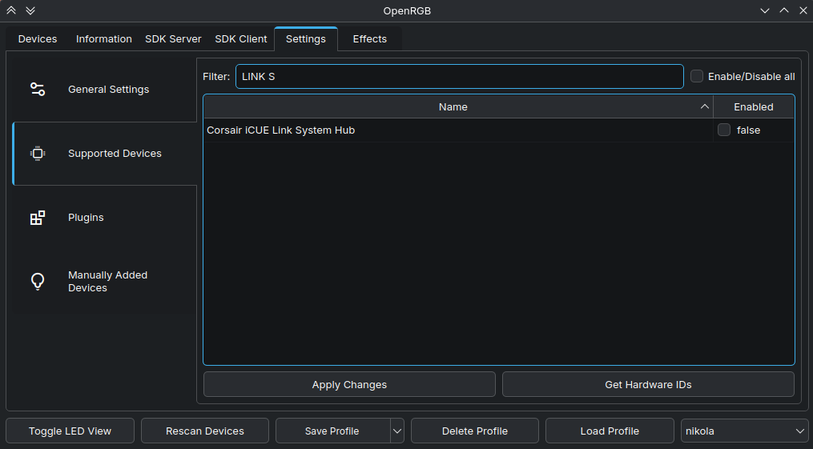
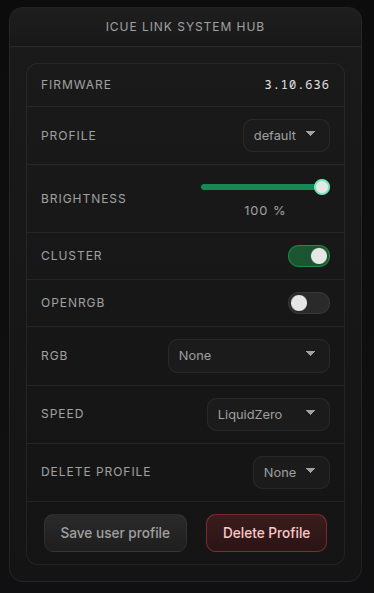
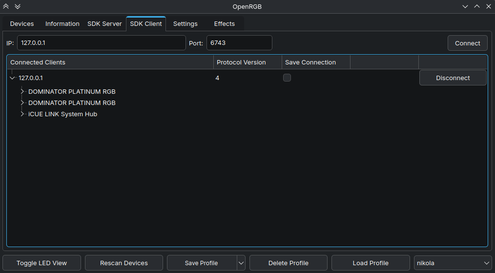

# OpenRGB Target Server (Inherited)

> [!IMPORTANT]
> This document describes the inherited, secondary target-server workflow in
> which LumenForge exposes supported native devices to an OpenRGB client. For
> the newer importer workflow, see
> [OpenRGB Device Import](../docs/openrgb-import.md).

The target server remains functional inherited OpenLinkHub behavior.
LumenForge retains direct hardware ownership and native device management,
including supported cooling, telemetry, LCD, profiles, and other controls.
OpenRGB connects to LumenForge to control the exposed lighting functionality.

This avoids having OpenRGB and LumenForge both attempt direct ownership of the
same native device. LumenForge keeps the hardware connection and exposes
compatible lighting control to OpenRGB.

## The Two OpenRGB Directions

### Target Server Documented Here

```text
LumenForge-managed native device
    -> LumenForge OpenRGB-compatible target server
    -> OpenRGB client
```

The target server exposes lighting control for supported LumenForge-managed
devices. It does not discover or import external OpenRGB devices.

### Importer Documented Elsewhere

```text
OpenRGB-supported device
    -> OpenRGB SDK Server
    -> LumenForge importer
```

The [OpenRGB importer](../docs/openrgb-import.md) lets LumenForge control
devices provided by a separately running OpenRGB SDK Server. It does not expose
LumenForge-native devices to an OpenRGB client.

The workflows serve opposite directions. Describing the target server as
inherited and secondary identifies its OpenLinkHub origin and its relationship
to the newer importer; those terms do not indicate reduced functionality.

## Configure the Target Server

Use the service commands that match the installation mode already in use. The
user-service installer remains experimental; the user-service commands below
are for users already testing that installation mode.

### Step 1: Stop LumenForge

For a system-service installation:

```bash
sudo systemctl stop LumenForge.service
```

For a user-service installation:

```bash
systemctl --user stop LumenForge.service
```

### Step 2: Configure the Listener

Update the installation's `config.json`:

```json
{
  "enableOpenRGBTargetServer": true,
  "openRGBPort": 6743
}
```

- `enableOpenRGBTargetServer` enables LumenForge's OpenRGB-compatible
  listener. It is a target-server setting, not an importer option.
- `openRGBPort` is the listener port while target-server mode is enabled.
- The listener cannot share a port with an external OpenRGB SDK Server. Users
  commonly choose `6743` when OpenRGB itself uses `6742`.
- Target-server mode and importer mode cannot use the same `openRGBPort`
  simultaneously.

### Step 3: Release OpenRGB's Direct Device Ownership

In OpenRGB, disable each native device that LumenForge will manage, then click
**Apply**. Rescan devices or restart OpenRGB afterward. This keeps OpenRGB from
opening the hardware directly while allowing it to connect to LumenForge's
target server.



### Step 4: Start LumenForge

For a system-service installation:

```bash
sudo systemctl start LumenForge.service
```

For a user-service installation:

```bash
systemctl --user start LumenForge.service
```

### Step 5: Enable Integration for the Device

In LumenForge, toggle **OpenRGB Integration** for each device to expose.



### Step 6: Connect the OpenRGB Client

In OpenRGB, open the **Client** tab and connect to the LumenForge host on port
`6743`, or the alternate port configured above.



## Supported Devices

| Device                 |
|------------------------|
| iCUE LINK System Hub   |
| iCUE COMMANDER Core    |
| iCUE COMMANDER Core XT |
| iCUE COMMANDER DUO     |
| ELITE AIOs             |
| PLATINUM AIOs          |
| Memory                 |
| MM700                  |
| MM800                  |

Supported devices may change as inherited compatibility and LumenForge support evolve.
